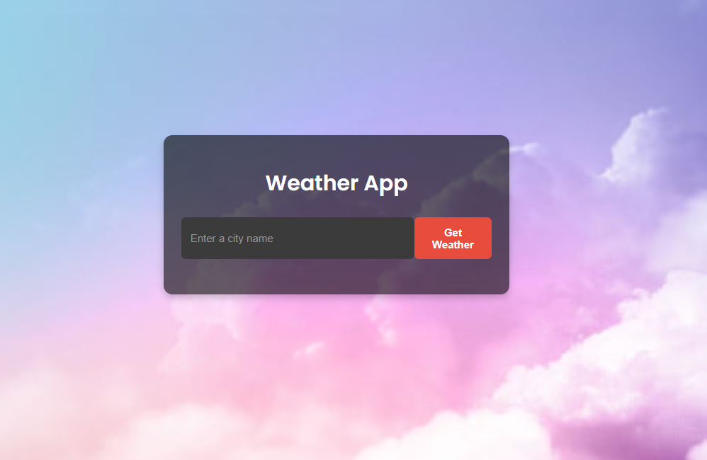
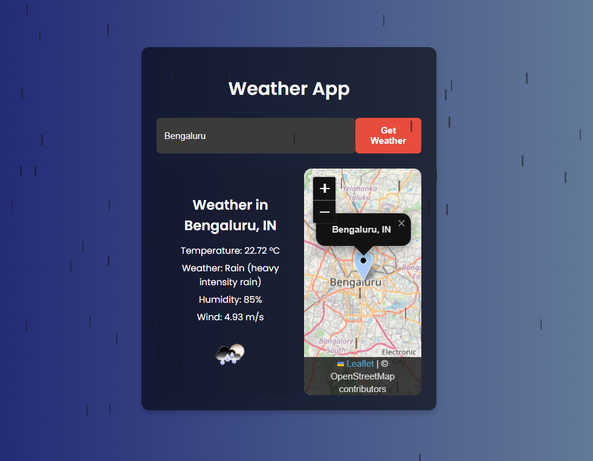

# Weather App

A simple and interactive web application that displays current weather information for a given city, along with a map pinpointing the location. It features dynamic backgrounds and a rain effect based on the weather conditions.




## Features

*   **Real-time Weather Data:** Fetches current temperature, weather conditions (main description & icon), humidity, and wind speed.
*   **City Search:** Users can input any city name to get its weather.
*   **Interactive Map:** Displays an interactive map (via Leaflet.js) showing the geographical location of the searched city.
*   **Dynamic Backgrounds:** The app's background changes dynamically based on the current weather conditions (e.g., clear, cloudy, rainy, snowy, hazy).
*   **Rain Effect:** A visual rain animation is displayed when the weather is rainy.
*   **Responsive Design:** Adapts to different screen sizes.

## Technologies Used

*   **HTML5**
*   **CSS3:**
    *   Flexbox for layout
    *   Custom animations (rain effect)
    *   Google Fonts (Poppins)
*   **JavaScript (ES6+):**
    *   `async/await` for asynchronous operations
    *   Fetch API for making HTTP requests
    *   DOM Manipulation
*   **OpenWeatherMap API:** For fetching weather data.
*   **Leaflet.js:** For rendering interactive maps.

## Setup and Installation

To run this project locally, follow these steps:

1.  **Clone the repository:**
    ```bash
    git clone https://github.com/Aksh2758/WeatherAPI.git
    cd WeatherAPI
    ```

2.  **Get an API Key:**
    *   Sign up for a free API key at [OpenWeatherMap](https://openweathermap.org/appid).

3.  **Configure API Key:**
    *   In the `assets/js/` directory, **you need to provide your API key**.
    *   Open the `assets/js/script.js` file.
    *   Find the line:
        ```javascript
        const apiKey = 'YOUR_API_KEY';
        ```
    *   Replace `'YOUR_API_KEY'` with the actual API key you obtained from OpenWeatherMap.
        ```javascript
        const apiKey = 'your_actual_openweathermap_api_key'; // Example
        ```
    *   **Important:** Do not commit your actual API key if you plan to make changes and push them back to a public repository. For local use, this method is fine. For sharing or deploying, consider environment variables or a separate untracked config file (see advanced setup below).

4.  **Open the Application:**
    *   Open the `index.html` file in your web browser.
    *   It's recommended to use a local web server (like VS Code's "Live Server" extension) to serve the files, as some browser features and API calls might have restrictions when opened directly from the `file:///` protocol.

## Usage

1.  Once the application is open in your browser, you will see an input field.
2.  Enter the name of a city (e.g., "London", "New York", "Tokyo") into the input field.
3.  Click the "Get Weather" button.
4.  The weather information for the entered city will be displayed, including temperature, conditions, humidity, and wind speed.
5.  An interactive map will also appear, pinpointing the city's location.
6.  The background of the app will change to reflect the current weather conditions. If it's raining, you'll see a rain animation.

## Project Structure
.

├── index.html # Main HTML file

├── assets/

│ ├── css/

│ │ └── style.css # Main stylesheet

│ ├── js/

│ │ └── script.js # Main JavaScript file

│ └── img/

│ └── image.png # Default background image (and others if any)

├── .gitignore # Specifies intentionally untracked files that Git should ignore

└── README.md # This file

## Future Enhancements (Possible Ideas)

*   Implement a 5-day weather forecast.
*   Add functionality to get weather based on user's current geolocation.
*   Allow users to switch between Celsius and Fahrenheit.
*   Add a loading spinner/indicator during API calls.
*   Store recent searches in local storage.
*   City input autocomplete.

## Contributing

Contributions are welcome! If you have suggestions for improvements or find any bugs, please feel free to open an issue or submit a pull request.

1.  Fork the Project
2.  Create your Feature Branch (`git checkout -b feature/AmazingFeature`)
3.  Commit your Changes (`git commit -m 'Add some AmazingFeature'`)
4.  Push to the Branch (`git push origin feature/AmazingFeature`)
5.  Open a Pull Request

